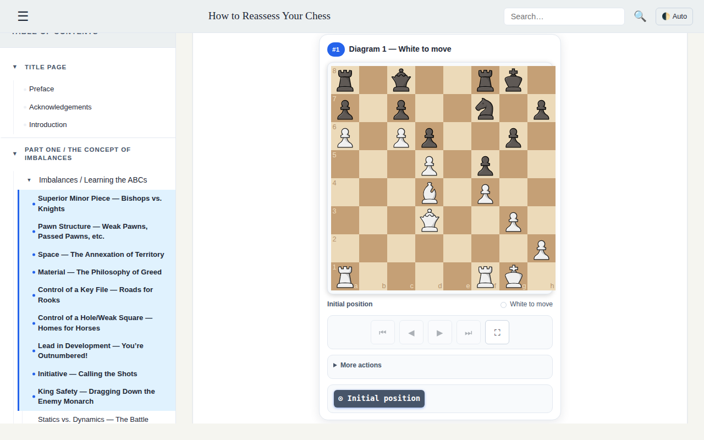

# How to Reassess Your Chess — Interactive Study App

Study _How to Reassess Your Chess_ (4th Edition) by Jeremy Silman with the book
text and **interactive chessboards** side by side: read a section, play
through its diagrams, explore variations, and search the whole book.



> **Copyright — read this first:** the public repo contains **no book text**.
> The reading data is generated locally from an EPUB **you buy legally**.
> Without it, the app shows a "book not generated" message — that is normal
> on a fresh clone.

## Features

- **Inline interactive diagrams** — every position rendered as a playable chessboard right in the text
- **Enlarged analysis board** — open any diagram in a modal to step through moves and variations
- **Section-by-section reading** — the book split into logical sections, with a progress bar
- **Full-text search** — find a concept across all sections, with matches highlighted in-page

## How it works

```text
EPUB you bought          Parser (Python)              Web app (JS)
───────────────    ─────────────────────────    ─────────────────────
Book text       →  cut into logical sections  →   read section by section
                   (one per chapter heading,
                    long ones subdivided)
PGN studies     →  positions + moves +       →    playable boards with
                   variations matched         variations, flip, FEN copy,
                   to each diagram            online analysis
```

- The **EPUB is the only source of the text** (chapters read in spine order).
- **Positions never come from the EPUB** — they come from local PGN studies
  (`pgn_studies/`), plus a few strict hand-checked fixes
  (`diagrams_manual_overrides.json`).
- The generated files (`book_structure.json`, `diagrams.json`, `toc.json`) are
  **gitignored**: they stay on your machine and are never committed.

## Quickstart

### 0. Buy the book

1. Buy _How to Reassess Your Chess_ (4th ed., Jeremy Silman) as an EPUB from a legal store.
2. Copy it to the **repo root** with this exact filename:

   ```text
   How to Reassess Your Chess 4th ed - Silman.epub
   ```

   It stays local — it is gitignored and never committed.

### 1. Generate the reading data (from the repo root)

```bash
python3 -m silman_parser.build
```

This reads the EPUB, matches diagrams against the local PGN studies, applies the
manual overrides, and writes `chess-app/data/{book_structure,diagrams,toc}.json`.

### 2. Run the app

```bash
cd chess-app
npm install   # once: vite, vitest, chess.js, cm-chessboard
npm run dev   # open http://localhost:5173
```

Production build:

```bash
npm run build    # prebuild copies data + board assets into public/, then vite build -> dist/
npm run preview  # serves the build at http://localhost:4173
```

### 3. Docker (optional, after step 1)

The Docker image does **not** embed the EPUB — generate the data locally first,
then from the repo root:

```bash
docker compose up -d --build   # open http://localhost:5174
```

## How to use

### Navigation

- **Side menu** (☰): open/close the table of contents; click any part or chapter to jump to it.
- **Previous / Next** buttons: walk through the sections in order; the progress bar tracks where you are.
- **Test sections** (titled "— Tests") show a _View answer →_ link under each diagram; answer sections link _← Back to test_.

### Inline diagrams

Each diagram in the text is a live board:

- **◀ ▶** step through the recorded moves, **⏮ ⏭** jump to start/end.
- **More actions**: flip the board (⇅), return to the start (⊙) or to the book position (📖), copy the FEN (⧉), open the position on Lichess (♞).
- **Enlarge** (⛶) opens the diagram in a large modal board with the full move list and variation selector.
- A move marked 📖 is the exact position shown in the book; moves marked ↳ jump into alternative variations.
- Diagrams whose position is unknown display a "default position" badge instead of failing silently.

### Search

- Type a few letters in the top-right search bar (search is debounced; `Enter` searches immediately).
- Click a result to jump to that passage — your search terms are highlighted in the text.
- `Esc` clears the search and returns to the current section.

### Keyboard shortcuts

| Keys           | Action                                                            |
| -------------- | ----------------------------------------------------------------- |
| `←` / `→`      | Previous / next section — or move by move when a board is focused |
| `Home` / `End` | Start / end of the line (focused or enlarged board)               |
| `V`            | Cycle through alternative variations                              |
| `?`            | Open / close the shortcuts help                                   |
| `Esc`          | Close dialog or enlarged board                                    |

## Project layout

```text
.
├── How to Reassess Your Chess 4th ed - Silman.epub  # you buy it, exact name required
├── pgn_studies/          # Local PGN studies — source of positions and games
├── silman_parser/       # parser: epub_ingest, san, segmentation, html_render,
│                        # diagram_context, pgn_sources, overrides, build (entry point)
├── tests/               # backend tests: parser unit tests + generated-data invariants
├── docker-compose.yml   # static Nginx on :5174 (generate data first, see above)
└── chess-app/           # web app (frontend)
    ├── index.html / vite.config.js / package.json / Dockerfile / nginx.conf
    ├── css/ / js/       # ES modules: ChessApp orchestrator, PlayableBoard core,
    │                    # inline + modal board managers, navigation, search
    ├── data/            # generated *.json (gitignored) + versioned manual overrides
    └── tests/           # frontend vitest suites (chess-utils, search)
```

See `AGENTS.md` for contributor conventions.

## Generated data files

All three are produced by `python3 -m silman_parser.build`, gitignored, and
must never be edited by hand:

| File                  | Content                                                                                                                                           |
| --------------------- | ------------------------------------------------------------------------------------------------------------------------------------------------- |
| `book_structure.json` | HTML sections: headings, paragraphs, `<div class="diagram-inline" data-diagram="N">` placeholders, `<div class="game-notation">` score blocks |
| `diagrams.json`       | One entry per diagram: `fen`, `initial_fen`, `moves`, `diagram_move_index`, plus a recursive variation tree (flattened in-app) |
| `toc.json`            | Native EPUB table of contents (starting at _Preface_); falls back to a section-derived TOC if absent |

`diagrams_manual_overrides.json` is the exception: versioned fixes applied last,
validated strictly (parseable FEN, replayable moves, position consistency — fail-fast).

## Tests

```bash
python3 -m unittest discover -s tests -v   # backend: parser + JSON invariants (stdlib only)
cd chess-app && npm test                    # frontend vitest (chess-utils + search)
```

JSON sanity checks:

```bash
python3 -m json.tool chess-app/data/book_structure.json > /dev/null
python3 -m json.tool chess-app/data/diagrams.json > /dev/null
python3 -m json.tool chess-app/data/toc.json > /dev/null
```

## Tech stack

- **Frontend**: vanilla JS (ES modules), [chess.js](https://github.com/jhlywa/chess.js) v1 (rules) + [cm-chessboard](https://github.com/shaack/cm-chessboard) v8 (SVG boards, `staunty` pieces) — all via npm, no CDN
- **Dev/build/test**: Vite 5, Vitest
- **Parser**: Python 3, standard library only (plus `python-chess` for the data-integrity tests)
- **Deploy (optional)**: multi-stage Docker build → Nginx
- Boards lazy-mount via `IntersectionObserver`; one shared `PlayableBoard` core drives both inline and modal boards

## Troubleshooting

| Symptom                                | Cause / fix                                                                                                         |
| -------------------------------------- | ------------------------------------------------------------------------------------------------------------------- |
| "Book data not found" panel            | Normal on fresh clone — buy the EPUB, place it at the root, run `python3 -m silman_parser.build`, restart the app   |
| Port `5173` busy                       | Vite picks the next free port (e.g. `5174`) — check the terminal output for the actual URL                          |
| Blank board / "default position" badge | Diagram with no known FEN (covered by the badge by design), or `npm install` not run (missing cm-chessboard assets) |

## License

The app code is yours to share. The book is © Jeremy Silman — no book text is
included in this repo (EPUB + generated JSONs are gitignored). Each user buys
the EPUB and generates the data locally for personal study only.
